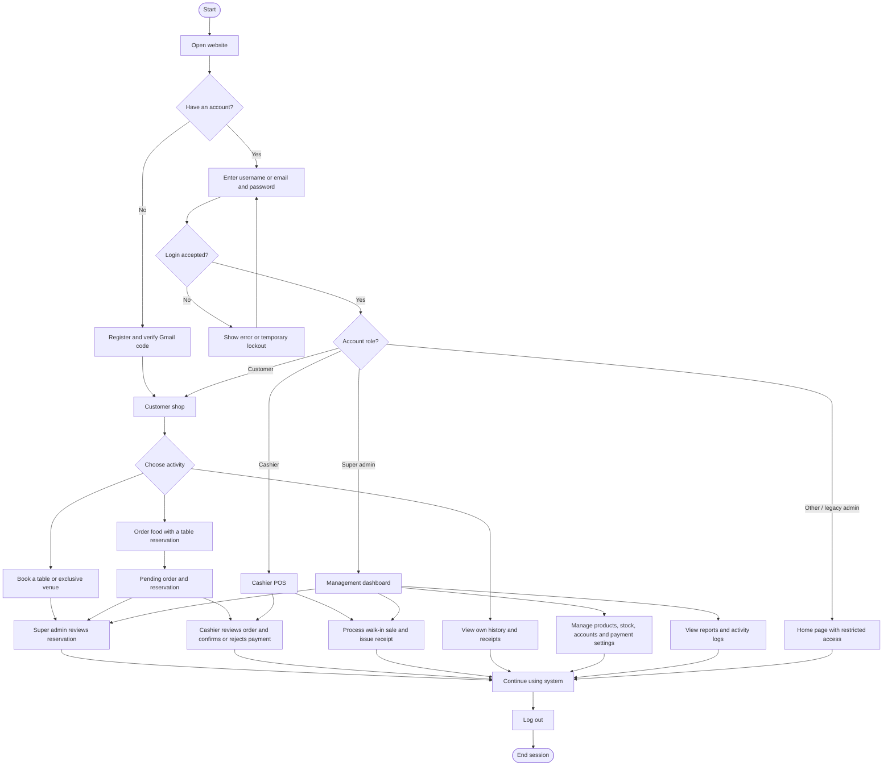
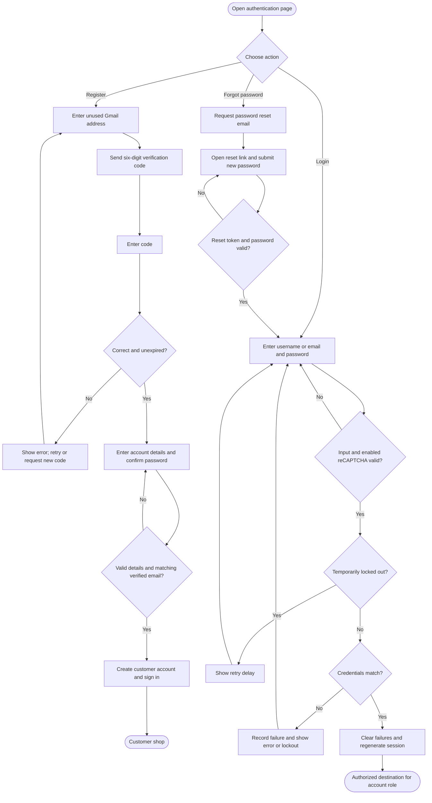
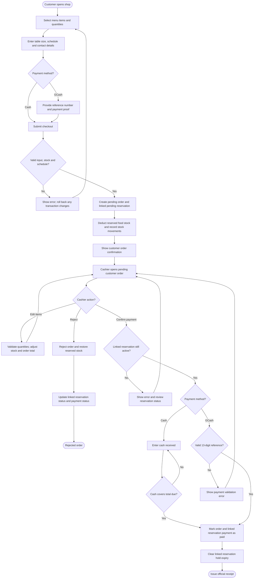
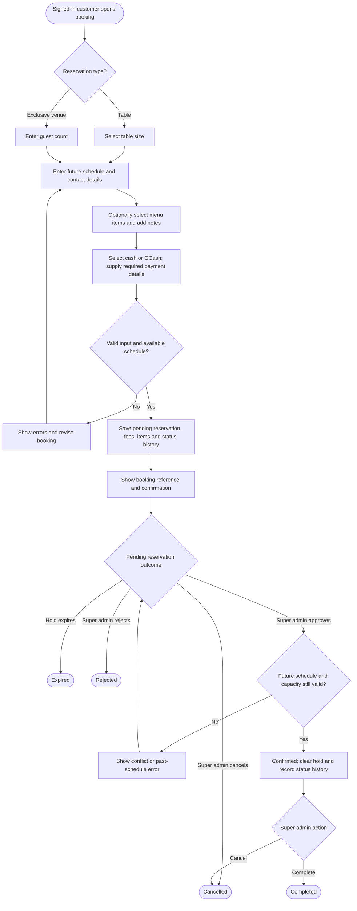
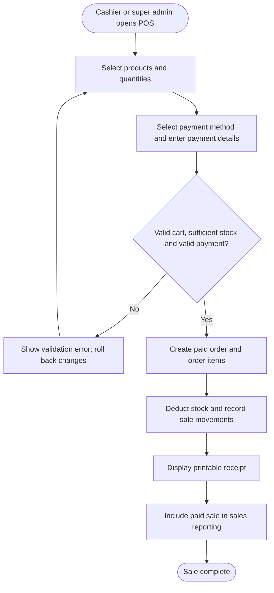
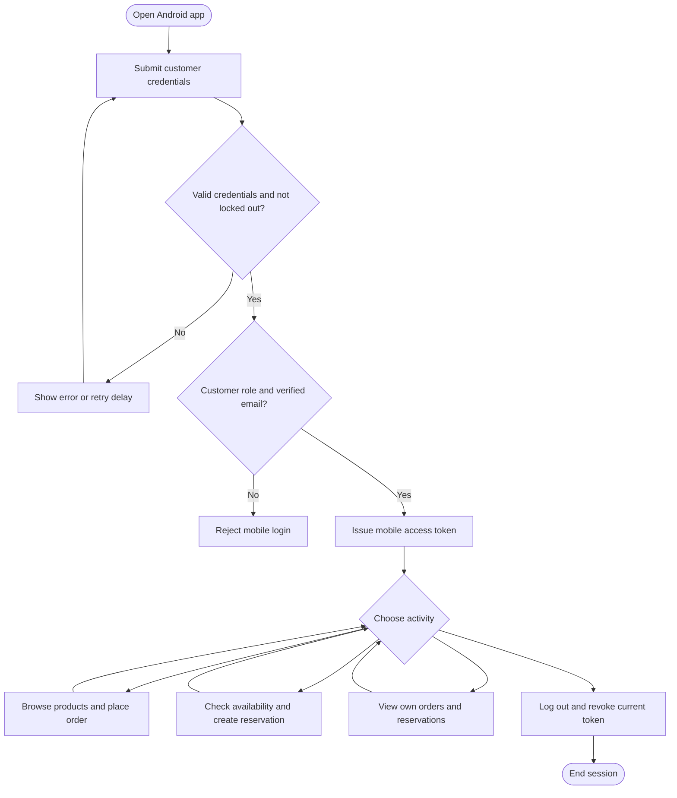

# Kermit's System Flowcharts

These diagrams describe the current routes, controllers, and services inspected on September 14, 2026. Open this file in a Markdown viewer with Mermaid support to render the charts. Rounded nodes mark entry or exit points, rectangles show actions, and diamonds show decisions.

## 1. Overall system flow (website)

Registration signs the new customer in automatically. Existing website sessions may resume an intended authorized page instead of the default role page. Legacy `admin` accounts have no administrative page access. Customer-order review and payment confirmation routes are cashier-only; super admins can process direct POS sales.

## 2. Website registration and login

The code sent for registration expires after ten minutes. The password recovery branch summarizes the reset-link flow; the website also provides a separate super-admin recovery entry point.

## 3. Customer order and cashier payment

- Website shop checkout always creates a linked table reservation. The mobile order API also supports cash orders without a reservation; GCash checkout requires reservation details.
- Uploading GCash proof does not automatically mark payment as paid. Cashier confirmation is a separate action.
- Total due includes the food order and the linked reservation charge. Reserved stock is deducted when the order is created, not again when payment is confirmed.
- Cashier rejection is subject to state checks; an order linked to a completed reservation cannot be rejected. A linked confirmed reservation is cancelled when its order is rejected.

## 4. Reservation booking and approval

Reservation status and payment status are separate. Super-admin approval changes the booking status; it does not mark payment as paid. Cashier payment confirmation for a linked order marks payment as paid without automatically confirming the booking.

Standalone bookings through `/book` or the mobile reservations API store selected food as reservation items and do not deduct product stock or create an order. Shop checkout uses the linked-order workflow in diagram 3. The pending-hold expiry branch applies only while a hold remains eligible to expire. The website booking confirmation uses a temporary signed link; customers can also view their own reservation details and receipts.

## 5. Walk-in POS sale

## 6. Mobile customer access

Mobile registration uses email-code verification before account creation. Staff use the website. Protected API requests authenticate the mobile token; reservation push notifications are supported for registered installations.

## Implementation sources

- [Website routes](../routes/web.php) and [mobile API routes](../routes/api.php)
- [Website authentication](../app/Http/Controllers/AuthController.php), [login validation](../app/Http/Requests/LoginRequest.php), [password recovery](../app/Http/Controllers/PasswordResetController.php), and [role destinations](../app/Models/User.php)
- [Customer checkout](../app/Http/Controllers/CustomerOrderController.php), [order transactions](../app/Services/OrderService.php), and [cashier actions](../app/Http/Controllers/CashierController.php)
- [Reservation booking](../app/Http/Controllers/ReservationController.php), [booking validation](../app/Http/Requests/StoreReservationRequest.php), and [scheduling and status transitions](../app/Services/ReservationSchedule.php)
- [Mobile authentication](../app/Http/Controllers/Api/MobileAuthController.php), [mobile orders](../app/Http/Controllers/Api/MobileOrderController.php), and [mobile reservations](../app/Http/Controllers/Api/MobileReservationController.php)
